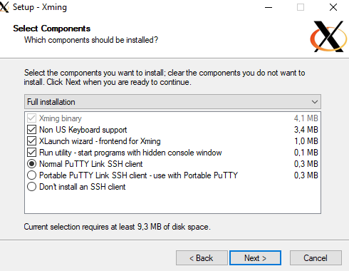
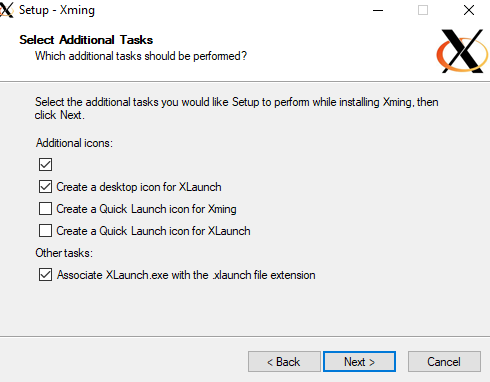
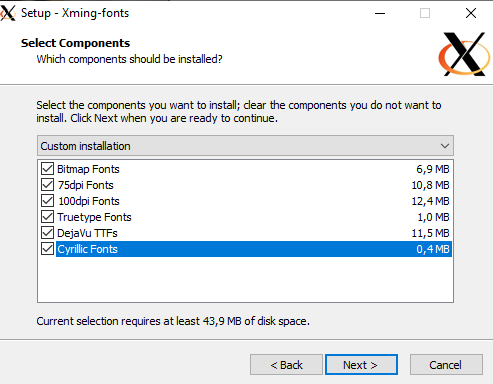
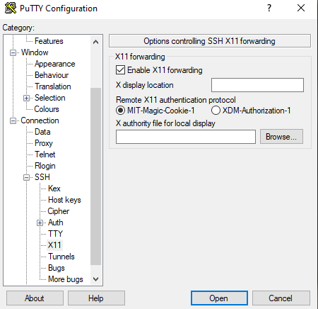
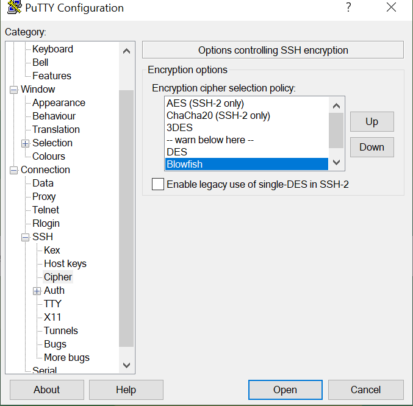
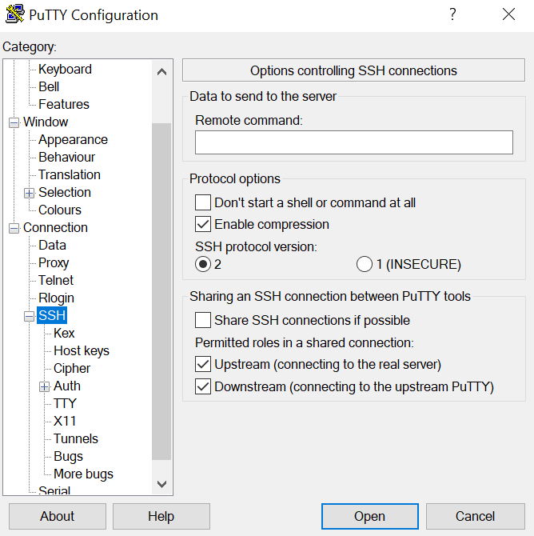
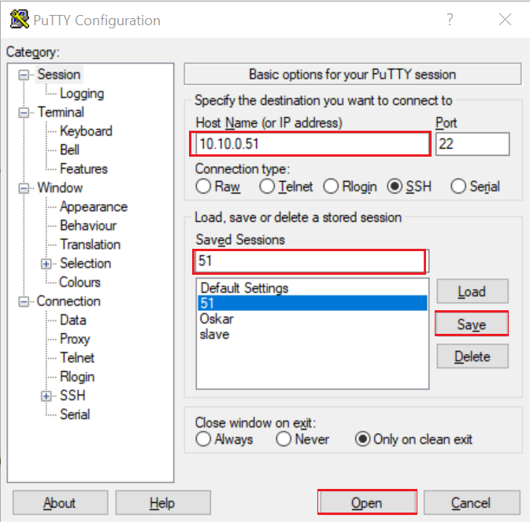
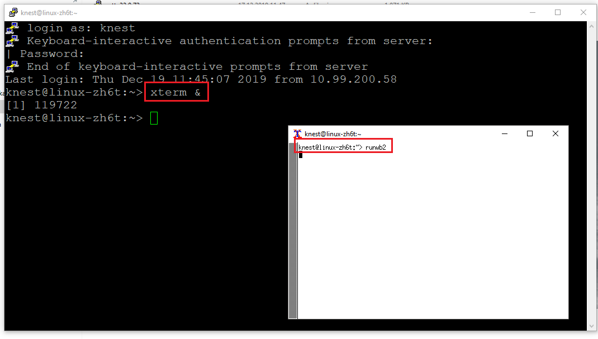
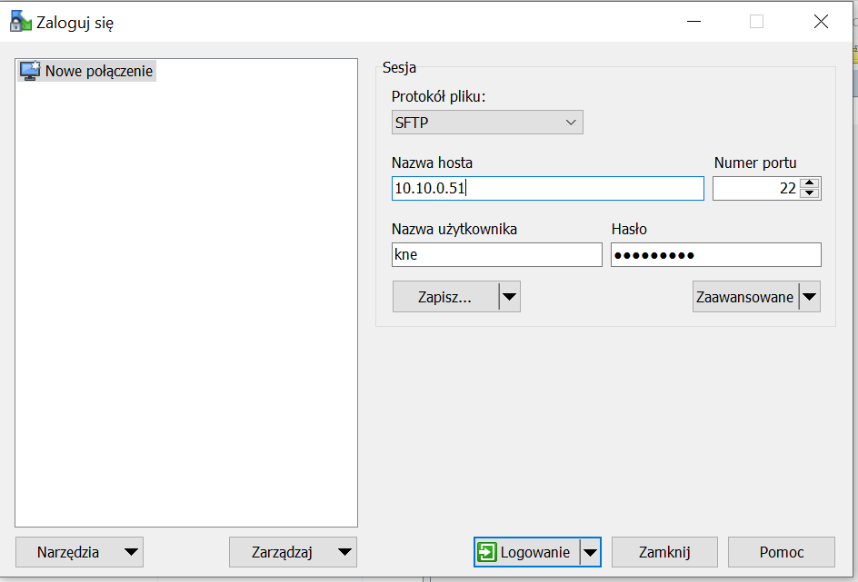
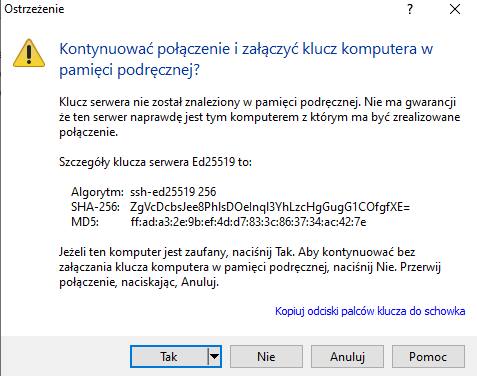

https://drive.google.com/open?id=1Q11mFp9bsFgZQTiMdAAdbyFg2evo766Z

## 1. Pobranie z dysku i instalacja wymaganego oprogramowania.

##### 1.1 PuTTY

Standardowa konfiguracja.

##### 1.2 WinSCP

Standardowa konfiguracja.

##### 1.3 Xming

Konfiguracja jak na obrazku.

##### 1.4 Xming-fonts

Konfiguracja jak na obrazku.

## 2. Konfiguracja i połączenie z serwerem KNE PW.

##### 2.1 Uruchom puTTY

##### 2.2 W drzewku po lewej stronie dwukrotnie kliknij na "SSH" a następnie wybierz "X11".

##### 2.3 W drzewku po lewej stronie wybierz "Cipher" i zaznacz opcję "Blowfish".

##### 2.4 W drzewku po lewej stronie kliknij na "SSH" i wybierz poniższe opcje:

##### 2.5 W drzewku po prawej stronie wybierz "Session". Następnie wprowadź odpowiedni adres IP (w przypadku połączenia z serwerem KNE z wykorzystaniem VPN jest to adres jak poniżej). W celu zapisania ustawień nadaj nazwę w polu "Saved Sessions" a następnie kliknij w przycisk "Save". Gotowe! Aby połączyć się z serwerem wybierz opcję "Open" w dolnej części okna.

##### 2.6 Pojawi się okno jak niżej. Kliknij "Tak".

## 3. Logowanie i uruchomienie programu Ansys 19.2 na serwerze.

##### 3.1 Udało Ci się nawiązać połączenie z serwerem. To co widzisz przed sobą jest tzw. konsolą. Aby się zalogować, użyj poniższych poleceń:

`kne` + enter

`DK12k21zx` + enter

`xterm &` + enter

##### 3.2 Otworzyła się następna konsola. Aby uruchomić Ansys 19.2 wpisz:

`runwb2 &` + enter

Zdjęcie jest poglądowe. Nie sugeruj się poleceniami na zdjęciu.

## 4. Wymiana plików z serwerem.

##### 4.1 Uruchom WinSCP. Do połączenia się z serwerem użyj tych samych danych co poprzednio. 

##### 4.2 Kliknij przycisk "Logowanie". Pojawi się okno jak poniżej. Wybierz "Tak". Sugeruję utworzyć katalog na dysku serwerowym ze swoim imieniem i nazwiskiem i tam przechowywać ***potrzebne* pliki**.

##### 

# Licencja KNE PW obejmuje obliczenia na maksymalnie 48 rdzeniach, więc polecam zadeklarowanie właśnie 48 rdzeni w ustawieniach Solvera.
